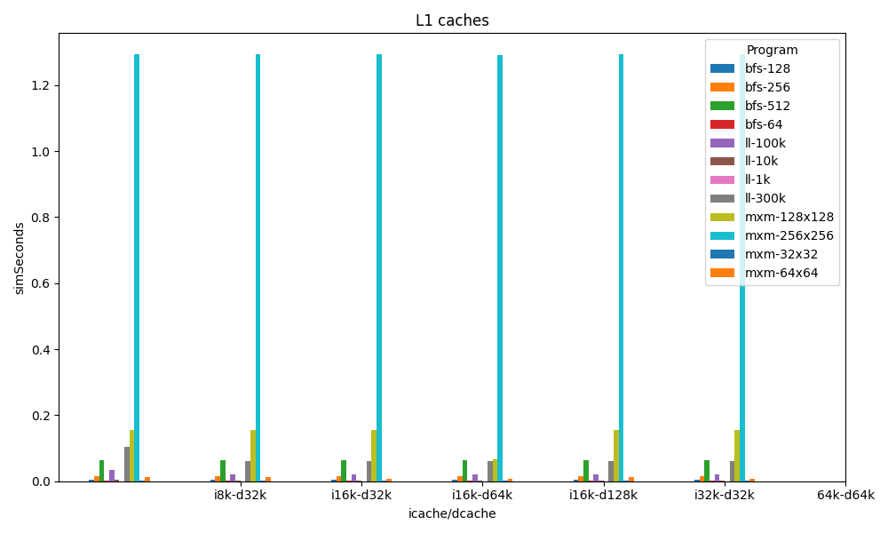

# Improving the performance of a RISC-V processor for specific programs
Author: William Maas
Local: Brazil
Date: 2023, September
Institution: UFRGS
Keywords: risc-v, gem5, cpu, programs, matrix multiplication, linked-list, breadth-first search

## Abstract
Today in the world of cutting-edge processor optimization, the marriage of innovation and specificity paves the a way for unprecedented performance gains. In the context of computer architecture, the RISC-V processor has emerged as a versatile and open-source platform, bringing the attention of researchers and developers alike. However, as programs become increasingly intricate and varied, the need to tailor processors to serve specific applications has become more apparent. This article dives into the task of enhancing RISC-V processor performance for specific programs, by deeply analyzing their behavior at runtime, and turning ideas into optimization strategies.

## Introduction
In this research, we are going to explore the problem of optimizing the runtime performance of specific programs for a RISC-V CPU, in order to do that we will need some tools to help simulate the programs, collect data, analyze the results, and validate the optimization hypotheses that we will propose. The end goal is to create a RISC-V CPU that is faster than the base model and/or costs less money.

### Gem5 simulator
The gem5 simulator is a versatile platform utilized for advanced research in computer-system architecture, encompassing both system-level architecture and processor micro architecture. Gem5 has several key features, including the availability of multiple interchangeable CPU models such as simple one-CPI, in-order, out-of-order, and KVM-based CPUs. Its event-driven memory system encompasses caches, snoop filters, DRAM controllers, and accommodates diverse memory types, allowing flexible arrangements to model complex cache hierarchies with heterogeneous memories. The simulator offers support for multiple instruction set architectures (ISAs) like Alpha, ARM, SPARC, MIPS, POWER, RISC-V, and x86, facilitating effective ISA decoupling from CPU models. This enables gem5 to support a range of guest platforms on various host platforms. Gem5 also accommodates homogeneous and heterogeneous multi-core systems with customizable topologies and employs cache coherence protocols for maintaining cache consistency. It possesses full-system capability for ARM, x86, RISC-V, and SPARC architectures, supporting booting of Linux, Android, and other operating systems. Additionally, gem5 operates in application-only mode, executing architecture/OS binaries through Linux emulation. Based on all these characteristics we chose the Gem5 simulator to use on this research.

### MinorCPU model
Within the Gem5 simulator, we also need to define a base CPU model to base our work on. Lucky for us, Gem5 has one that is well designed for the kind of experimentation we plan to do perform, the MinorCPU which was chosen for this project.
The Gem5's Minor CPU model is an in-order processor model with a fixed pipeline but configurable data structures and execution behavior. It is intended to be used to model processors with strict in-order execution behavior and allows visualization of an instruction’s position in the pipeline through the minorview tool. The intention is to provide a framework for micro-architecturally correlating the model with a particular, chosen processor with similar capabilities. More details about the Minor CPU architecture can be found at the Gem5 [website](https://www.gem5.org/documentation/general_docs/cpu_models/minor_cpu).

### Programs
The three programs that we are going to try to optimize are: Matrix multiplication (MxM), Linked List traversal (LL), and Graph Breadth-First Search (BFS). These programs were chosen because each one has different characteristics when it comes to CPU needs. The source code for the programs will be written in the C language, and cross-compiled to RISC-V binaries using a cross-compilation tool.

## Methods
The methodology chosen for this research was quantitative, where we defined a structured way to collect data, proposed some optimization strategies, and analyzed the results. The structure of our experiments is explained in the following sections.

### Programs
In order to perform exploratory tests and come up with some performance optimization hypotheses, we structured our programs and input datasets in a scalar way, where the input data for the programs were divided into four sets (small, medium, large, very large) for each program, and each dataset had a significant increase in size (and consequentially execution time). The datasets used for each programs are as follows:
- MxM
  - 32x32 - small
  - 64x64 - medium
  - 128x128 - large
  - 256x256 - very large
- LL
  - 1k nodes - small
  - 10k nodes - medium
  - 100k nodes - large
  - 300k nodes - very large
- BFS
  - 64 vertices - small
  - 128 vertices - medium
  - 256 vertices - large
  - 512 vertices - very large

### Base CPU specifications
On Gem5, we used the base CPU model that it comes with, and the hardware specifications are the following:
- Architecture: RISC-V
- CPU model: MinorCPU
- Clock speed: 2Ghz
- RAM: 1x 512Mb DDR3 1600Mhz
- L1 ICache: 32k
- L1 DCache: 32k
- L2 Cache: N/A

### Base CPU performance stats
To start we collected metrics for the simulation of all programs with their dataset variations, so we can better understand the runtime behavior of the programs, and propose some hypotheses. Gem5 gives us a large number of statistics about the CPU behavior during the execution, but for this research, we choose to look at the stats that matter the most for our end goal which are the simulation seconds and cycles per instruction. Below are the statistics for programs running on the Base CPU model.

#### Base CPU stats

#### Instruction distribution
<!-- TODO: use a chart -->
| Program | Mem    | FloatAlu | IntAlu | IntMult | IntDiv | NoOp  |
| ------- | ------ | -------- | ------ | ------- | ------ | ----- |
| MxM     | 44.45% | 4.45%    | 46.65% | 4.43%   | 0.0%   | 0.0%  |
| LL      | 36.49% | 1.09%    | 62.40% | 0.0%    | 0.0%   | 0.0%  |
| BFS     | 36.17% | 0.0%     | 63.34% | 0.0%    | 0.15%  | 0.31% |

### Optimization strategies
It is generally known that Caches play a pivotal role in modern processors by bridging the speed gap between the fast CPU and the relatively slower main RAM memory, and they are essential for improving overall system performance and efficiency. Based on that, the first optimization strategy is to optimize the L1 instruction and data cache sizes and experiment with adding an L2 cache. Another characteristic of modern general-purpose CPUs is that they can explore ILP (instruction level parallelism) on any program during the execution time, so the second hypothesis is to try and explore ILP on the three specific programs and tweak the CPU execution unit towards their specificity. Summarizing, here are the chosen optimization strategies:
- Optimize L1 instruction and data cache sizes.
- Adding an L2 cache.
- Tweak the CPU execution unit to explore ILP on the specific programs.

## Results
The results obtained for the three proposed optimization strategies are described in detail on the following sections.

### Optimize L1 instruction and data cache sizes
The first strategy is to optimize the L1 cache sizes and validate if there are any performance gains that can be obtained. The base CPU has a 32k instruction cache and a 32k data cache, we performed tests with instruction cache sizes of 8k/16k/32k/64k, combining with data caches of 32k/64k/128k for all programs and the input data variants.

With the results obtained, we can observe the following:
- Instruction cache adds value up until 16k, after that, there were no performance gains for all programs.
- Data cache greater than 32k doesn't provide performance gains to the LL and BFS programs.
- A MxM of size 128x128 has a performance gain from a data cache of 128k.
- The MxM program reaches its peak performance for large matrices (128x128 plus) with a data cache of 32k.

Based on this analysis we can say that a L1 instruction and data cache of 16k/32k is the optimal choice with cost-benefit in mind.

### Add a L2 cache
Based on the same principle of the L1 caches, we analyzed the performance of the CPU after adding an L2 cache of different sizes. For the test, we used the optimal L1 cache combination of 16k/32k and some other variations (16k/64k and 16k/128k which also had a good performance), in combination with an L2 cache of sizes 128k and 256k.
<!-- TODO: add chart
The results obtained can be seen in the following chart.-->

With the results obtained, we could observe the following:
- The L2 cache had a small performance improvement in a `small` MxM.
- The L2 cache made the performance of MxM greater than `small` worse.
- The L2 cache made the performance of LL worse.
- The L2 cache made the performance of BFS worse.

### CPU execution unit tweaks
After the cache optimization, the strategy to speed up the base CPU model even further is by adding more raw processing power. There are a lot of ways of doing that, but ideally, we need to find the right balance between instruction fetching and decoding capacity, execution buffers, logic and arithmetic FUs (Functional Units), memory I/O capacity, and so on. After performing exploratory tests with different sets of hardware additions and tweaks, we could find some optimal choices, that are defined by the following parameters on Gem5.
- Increasing the Integer FUs from 2 to 4.
- Increasing the instruction decode buffer from 2 to 12.
- Increasing the execution unit buffer from 2 to 6.
- Increasing the execution issue limit from 2 to 4.
- Increasing the capacity to read/write from memory from 2 to 4.
With these tweaks, we got some really good results that can be seen on the chart below.

In order to have a better view of the performance gains scale for the different input sizes, we can plot the same chart with the `simSeconds` in logarithmic scale.

## Discussion
The pursuit of optimizing the runtime performance of specific programs for RISC-V CPUs, using the Gem5 simulator and the MinorCPU model, has led us to valuable insights and results. In this section, we delve into the implications and significance of our findings and discuss their broader implications for computer architecture and optimization.

### Cache Optimization
Our first optimization strategy focused on adjusting the sizes of the L1 instruction and data caches and exploring the addition of an L2 cache. The results highlighted the critical role of cache size in program performance.

For the L1 caches, we observed that increasing the instruction cache size up to 16k yielded performance gains, emphasizing the importance of accommodating instruction data efficiently. However, beyond 16k, additional increases did not yield further improvements, indicating diminishing returns. In contrast, the data cache showed varying results. For the Matrix multiplication (MxM) program, larger data caches, such as 128k, led to performance improvements, especially for larger matrix sizes. However, for Linked List traversal (LL) and Graph Breadth-First Search (BFS), larger data caches did not result in significant gains. These findings suggest that cache size optimization should be tailored to the specific program's memory access patterns and requirements.

Regarding the L2 cache, our experiments did not yield consistent performance improvements. In fact, for some programs, including LL and BFS, the addition of an L2 cache led to performance degradation. These results highlight the complexity of cache hierarchies and the need for careful consideration of cache configurations based on program characteristics. A one-size-fits-all approach is insufficient, and optimizing cache hierarchies requires a program-specific focus.

### CPU Execution Unit Tweaks
The second optimization strategy involved enhancing the CPU execution unit to explore instruction-level parallelism (ILP) for the specific programs under study. We made adjustments to various hardware parameters within Gem5, including Integer Functional Units (FUs), instruction decode buffer, execution unit buffer, execution issue limit, and memory I/O capacity.

Our findings revealed that increasing the Integer FUs and expanding various buffer sizes led to substantial performance improvements. These enhancements effectively increased the raw processing power of the CPU, allowing it to handle multiple instructions concurrently. This approach proved effective for all three programs since we could could exploit ILP. The logarithmic scale plot of simSeconds demonstrated the scalability of performance gains with different input sizes showing that the hardware extensions scaled well across various program sizes, indicating its robustness and potential for broader applicability.

<!-- TODO:
### Cost analysis -->

## References
https://www.gem5.org/about/
https://github.com/riscv-collab/riscv-gnu-toolchain
https://psychology.ucsd.edu/undergraduate-program/undergraduate-resources/academic-writing-resources/writing-research-papers/research-paper-structure.html

<!-- TODO:
## Tables and Figures -->
